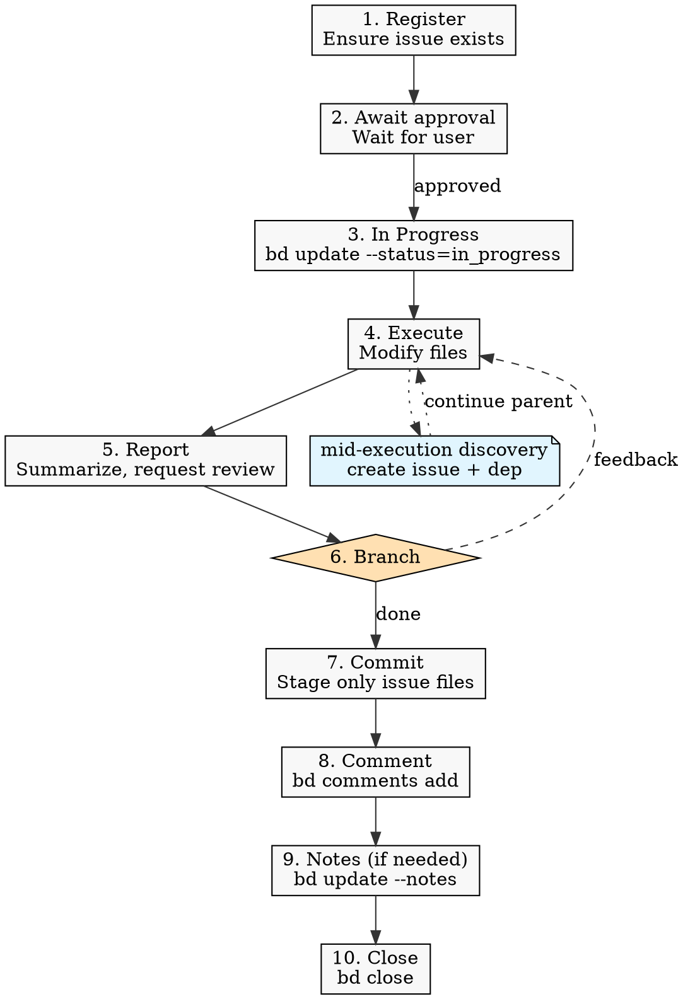

# Agents

## Project Overview

This project is a UI layer for the `bd` (Beads) CLI tool — it consumes `bd` via
CLI (`child_process.spawn`) and renders its output as a user interface.

`bd` is an external dependency outside this project's control. Do **not** assume
`bd` can be modified to add fields, flags, or output format changes. All
limitations (missing dependency types in JSON output, fixed command interfaces,
etc.) must be accepted and worked around on the UI side. When `bd`'s output is
insufficient (e.g., `bd show --json` omits dependency type), compensate in the
server/adaptation layer or accept the limitation — never block on upstream
changes.

## Working Conventions

The `bd` command reference is injected by the SessionStart hook; this section
defines only project-specific conventions.

### Agent Workflow

Every file-modifying task, including trivial doc edits, follows these 10 steps:



1. **Register** — ensure a beads issue exists (create if needed, or confirm an
   existing one covers the scope).
2. **Await approval** — do not start until the user approves. Multiple
   pre-registered issues may be approved together.
3. **In progress** — `bd update <id> --status=in_progress` immediately before
   touching any file.
4. **Execute.**
5. **Report** — summarize changes and request confirmation. If the description
   contains a verification section (e.g., `## 검증`), execute every item and
   include the outcomes; never announce `완료` while any verification item is
   still outstanding.
6. **Branch on response** — `완료` → step 7. Anything else is feedback; return
   to step 4 (status stays `in_progress`).
7. **Commit** — stage only files for this issue and commit. Never run
   `git push`.
8. **Comment** — `bd comments add <id> "<text>"` (positional text, **not**
   `--message` flag); include the actual commit hash and commit message for the
   commit from step 7.
9. **Notes** — use `bd update <id> --notes="..."` for durable context not
   already captured in the diff, commit, or comment. **Required when step 6
   feedback modified the recorded decision**, using the matching prefix so the
   two cases stay separable later:
   - `피드백으로 추가: <항목>. 커밋: <hash>` — scope was added while METHOD
     itself stayed intact.
   - `결정 변경: <변경 내용>. 커밋: <hash>` — METHOD itself was revised
     (decision reversal). Also update the issue's `### 고려한 대안` from step 1.
10. **Close** — `bd close <id> --reason="..."`.

**Session signals:** only `승인` (step 1→3) and `완료` (step 6→7) carry workflow
meaning.

For command examples, see [`docs/beads-commands.md`](docs/beads-commands.md).

### Operating Mode

> **Overrides** the Auto-Sync and Session Completion sections below.

Local-only: no Dolt remote. Do **not** run `bd dolt pull`/`bd dolt push` (the
SessionStart hook's "Session Close Protocol" does not apply here). The entire
`.beads/` directory is gitignored except for `.beads/.gitkeep`, which is tracked
as a marker. Fresh-clone setup steps live in
[`docs/bd-setup.md`](docs/bd-setup.md). Update this section if a Dolt remote is
added later.

### Language

- Write all beads issue narrative fields (title, description, notes, design) in
  **Korean**. Identifiers, commands, file paths, and code snippets stay in their
  original form.

### Issue Content

- Every description must expose both **WHAT** and **METHOD** under clear
  headings (e.g., `## 무엇을 (WHAT)`, `## 어떻게 (METHOD)`).
  - **WHAT** — the target problem/outcome (why this issue exists, what must
    change).
  - **METHOD** — the agreed approach. Implementation detail belongs in `notes`
    after the work is done (step 9).
- Add a `### 고려한 대안` subsection under METHOD **only when** one of the
  following triggers fired:
  - Two or more concrete implementations were actually compared during
    discussion.
  - The user rejected one approach and directed another.
  - The step 6 feedback loop changed METHOD itself (preserve the prior METHOD
    alongside the new one).

  Do not create the subsection just to fill in alternatives that would be
  rejected by common sense — the absence of the subsection itself signals "no
  alternatives were discussed."

- **Issue type** — `bug` (broken behavior) / `feature` (new functionality) /
  `task` (work item: tests, docs, refactor) / `epic` (large feature with
  subtasks) / `chore` (maintenance).
- **Priority** — `0` critical / `1` high / `2` medium (default) / `3` low / `4`
  backlog.

### Concurrency

Only **one** issue may be `in_progress` per session. Multiple issues can be
approved together, but execute them sequentially.

### Commit Rules

> **Overrides** the Session Completion section below regarding `git push`.

- Stage only files belonging to the closed issue; report any unrelated
  working-tree changes to the user instead of sweeping them in.
- Follow the existing commit message convention: `chore:`, `feat(scope):`,
  `fix:`, etc.
- Never run `git push`.
- Never update `CHANGES.md`.
- Never bypass git hooks (`--no-verify`, `LEFTHOOK=0`, or any equivalent
  flag/env). If a hook fails, fix the underlying issue and retry.

### Shell Safety

When invoking `bd` with narrative arguments (`--description`, `--notes`,
`--reason`, `bd comments add` body, etc.), **wrap the value in single quotes**
by default:

```bash
bd close bdui-42 --reason='커밋 abc1234: `결정 변경` 규약 적용'
```

Rationale: inside double quotes, the shell still expands `` ` ``, `$`, and `!`.
Backtick-wrapped Korean text such as `` `피드백으로 추가:` `` is then treated as
command substitution and silently truncated from the stored value.

Switch to a heredoc form **only when** the content itself contains a single
quote:

```bash
bd close bdui-42 --reason="$(cat <<'EOF'
본문에 ' 가 포함된 경우만 이 형식을 사용.
EOF
)"
```

### Setup Exceptions

If a one-time setup prerequisite is missing (e.g., `issue_prefix` not
configured), ask the user before configuring it, then resume the normal flow.

## Coding Standards

See [`docs/coding-standards.md`](docs/coding-standards.md) for naming, JSDoc,
module, and unit-test conventions.

## Pre-Handoff Validation

Validation is enforced by lefthook (`lefthook.yml`) — the source of truth. Hooks
install automatically via `pnpm install`; run `pnpm exec lefthook install` once
after a fresh clone if they are missing.

After changing UI sources under `app/`, run `pnpm build` to regenerate
`app/main.bundle.js` — `pnpm all` does **not** build.
