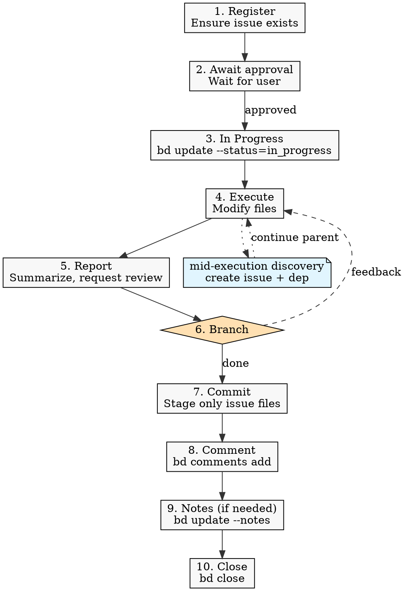

# Agents

## Project Overview

This project is a UI layer for the `bd` (Beads) CLI tool — it consumes `bd` via
CLI (`child_process.spawn`) and renders its output as a user interface.

`bd` is an external dependency outside this project's control. Do **not** assume
`bd` can be modified to add fields, flags, or output format changes. All
limitations (missing dependency types in JSON output, fixed command interfaces,
etc.) must be accepted and worked around on the UI side. When `bd`'s output is
insufficient (e.g., `bd show --json` omits dependency type), compensate in the
server/adaptation layer or accept the limitation — never block on upstream
changes.

## Working Conventions

The `bd` command reference is injected by the SessionStart hook; this section
defines only project-specific conventions.

### Agent Workflow

Every file-modifying task, including trivial doc edits, follows these 10 steps:



1. **Register** — ensure a beads issue exists (create if needed, or confirm an
   existing one covers the scope).
2. **Await approval** — do not start until the user approves. Multiple
   pre-registered issues may be approved together.
3. **In progress** — `bd update <id> --status=in_progress` immediately before
   touching any file.
4. **Execute.**
5. **Report** — summarize changes and request confirmation. If the description
   contains a verification section (e.g., `## 검증`), execute every item and
   include the outcomes; never announce `완료` while any verification item is
   still outstanding.
6. **Branch on response** — `완료` → step 7. Anything else is feedback; return
   to step 4 (status stays `in_progress`).
7. **Commit** — stage only files for this issue and commit. Never run
   `git push`.
8. **Comment** — `bd comments add <id> "<text>"` (positional text, **not**
   `--message` flag); include the actual commit hash and commit message for the
   commit from step 7.
9. **Notes** — use `bd update <id> --notes="..."` for durable context not
   already captured in the diff, commit, or comment. **Required when step 6
   feedback modified the recorded decision**, using the matching prefix so the
   two cases stay separable later:
   - `피드백으로 추가: <항목>. 커밋: <hash>` — scope was added while METHOD
     itself stayed intact.
   - `결정 변경: <변경 내용>. 커밋: <hash>` — METHOD itself was revised
     (decision reversal). Also update the issue's `### 고려한 대안` from
     step 1.
10. **Close** — `bd close <id> --reason="..."`.

**Session signals:** only `승인` (step 1→3) and `완료` (step 6→7) carry workflow
meaning.

For command examples, see [`docs/beads-commands.md`](docs/beads-commands.md).

### Operating Mode

> **Overrides** the Auto-Sync and Session Completion sections below.

Local-only: no Dolt remote. Do **not** run `bd dolt pull`/`bd dolt push` (the
SessionStart hook's "Session Close Protocol" does not apply here).
`.beads/issues.jsonl` is gitignored; only minimal markers (e.g.,
`.beads/metadata.json`) are tracked. Update this section if a Dolt remote is
added later.

### Language

- Write all beads issue narrative fields (title, description, notes, design) in
  **Korean**. Identifiers, commands, file paths, and code snippets stay in their
  original form.

### Issue Content

- Every description must expose both **WHAT** and **METHOD** under clear
  headings (e.g., `## 무엇을 (WHAT)`, `## 어떻게 (METHOD)`).
  - **WHAT** — the target problem/outcome (why this issue exists, what must
    change).
  - **METHOD** — the agreed approach. Implementation detail belongs in `notes`
    after the work is done (step 9).
- Add a `### 고려한 대안` subsection under METHOD **only when** one of the
  following triggers fired:
  - Two or more concrete implementations were actually compared during
    discussion.
  - The user rejected one approach and directed another.
  - The step 6 feedback loop changed METHOD itself (preserve the prior METHOD
    alongside the new one).

  Do not create the subsection just to fill in alternatives that would be
  rejected by common sense — the absence of the subsection itself signals
  "no alternatives were discussed."

### Concurrency

Only **one** issue may be `in_progress` per session. Multiple issues can be
approved together, but execute them sequentially.

### Commit Rules

> **Overrides** the Session Completion section below regarding `git push`.

- Stage only files belonging to the closed issue; report any unrelated
  working-tree changes to the user instead of sweeping them in.
- Follow the existing commit message convention: `chore:`, `feat(scope):`,
  `fix:`, etc.
- Never run `git push`.
- Never update `CHANGES.md`.
- Never bypass git hooks (`--no-verify`, `LEFTHOOK=0`, or any equivalent
  flag/env). If a hook fails, fix the underlying issue and retry.

### Setup Exceptions

If a one-time setup prerequisite is missing (e.g., `issue_prefix` not
configured), ask the user before configuring it, then resume the normal flow.

## Coding Standards

See [`docs/coding-standards.md`](docs/coding-standards.md) for naming, JSDoc,
module, and unit-test conventions.

## Pre-Handoff Validation

Validation is enforced by lefthook (`lefthook.yml`) — the source of truth. Hooks
install automatically via `pnpm install`; run `pnpm exec lefthook install` once
after a fresh clone if they are missing.

After changing UI sources under `app/`, run `pnpm build` to regenerate
`app/main.bundle.js` — `pnpm all` does **not** build.

<!-- BEGIN BEADS INTEGRATION v:1 profile:full hash:f65d5d33 -->

## Issue Tracking with bd (beads)

**IMPORTANT**: This project uses **bd (beads)** for ALL issue tracking. Do NOT
use markdown TODOs, task lists, or other tracking methods.

### Why bd?

- Dependency-aware: Track blockers and relationships between issues
- Git-friendly: Dolt-powered version control with native sync
- Agent-optimized: JSON output, ready work detection, discovered-from links
- Prevents duplicate tracking systems and confusion

### Quick Start

**Check for ready work:**

```bash
bd ready --json
```

**Create new issues:**

```bash
bd create "Issue title" --description="Detailed context" -t bug|feature|task -p 0-4 --json
bd create "Issue title" --description="What this issue is about" -p 1 --deps discovered-from:bd-123 --json
```

**Claim and update:**

```bash
bd update <id> --claim --json
bd update bd-42 --priority 1 --json
```

**Complete work:**

```bash
bd close bd-42 --reason "Completed" --json
```

### Issue Types

- `bug` - Something broken
- `feature` - New functionality
- `task` - Work item (tests, docs, refactoring)
- `epic` - Large feature with subtasks
- `chore` - Maintenance (dependencies, tooling)

### Priorities

- `0` - Critical (security, data loss, broken builds)
- `1` - High (major features, important bugs)
- `2` - Medium (default, nice-to-have)
- `3` - Low (polish, optimization)
- `4` - Backlog (future ideas)

### Workflow for AI Agents

1. **Check ready work**: `bd ready` shows unblocked issues
2. **Claim your task atomically**: `bd update <id> --claim`
3. **Work on it**: Implement, test, document
4. **Discover new work?** Create linked issue:
   - `bd create "Found bug" --description="Details about what was found" -p 1 --deps discovered-from:<parent-id>`
5. **Complete**: `bd close <id> --reason "Done"`

### Quality

- Use `--acceptance` and `--design` fields when creating issues
- Use `--validate` to check description completeness

### Lifecycle

- `bd defer <id>` / `bd supersede <id>` for issue management
- `bd stale` / `bd orphans` / `bd lint` for hygiene
- `bd human <id>` to flag for human decisions
- `bd formula list` / `bd mol pour <name>` for structured workflows

### Auto-Sync

bd automatically syncs via Dolt:

- Each write auto-commits to Dolt history
- Use `bd dolt push`/`bd dolt pull` for remote sync
- No manual export/import needed!

### Important Rules

- ✅ Use bd for ALL task tracking
- ✅ Always use `--json` flag for programmatic use
- ✅ Link discovered work with `discovered-from` dependencies
- ✅ Check `bd ready` before asking "what should I work on?"
- ❌ Do NOT create markdown TODO lists
- ❌ Do NOT use external issue trackers
- ❌ Do NOT duplicate tracking systems

For more details, see README.md and docs/QUICKSTART.md.

## Session Completion

**When ending a work session**, you MUST complete ALL steps below. Work is NOT
complete until `git push` succeeds.

**MANDATORY WORKFLOW:**

1. **File issues for remaining work** - Create issues for anything that needs
   follow-up
2. **Run quality gates** (if code changed) - Tests, linters, builds
3. **Update issue status** - Close finished work, update in-progress items
4. **PUSH TO REMOTE** - This is MANDATORY:
   ```bash
   git pull --rebase
   bd dolt push
   git push
   git status  # MUST show "up to date with origin"
   ```
5. **Clean up** - Clear stashes, prune remote branches
6. **Verify** - All changes committed AND pushed
7. **Hand off** - Provide context for next session

**CRITICAL RULES:**

- Work is NOT complete until `git push` succeeds
- NEVER stop before pushing - that leaves work stranded locally
- NEVER say "ready to push when you are" - YOU must push
- If push fails, resolve and retry until it succeeds

<!-- END BEADS INTEGRATION -->
